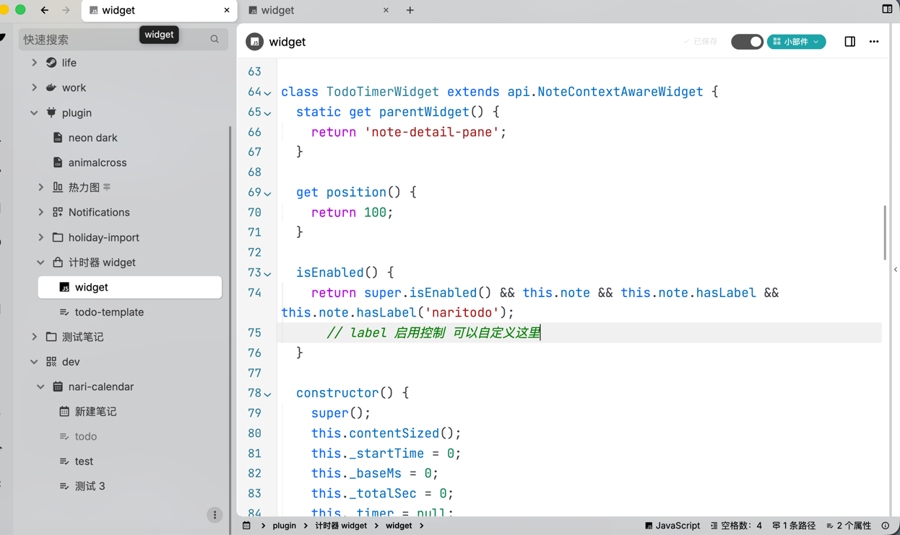
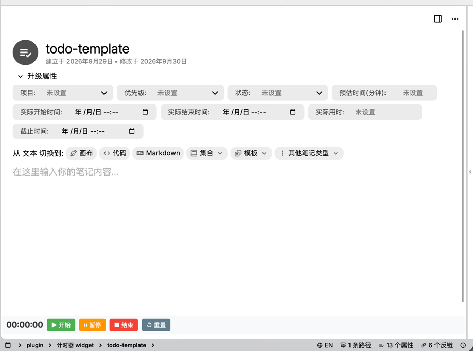
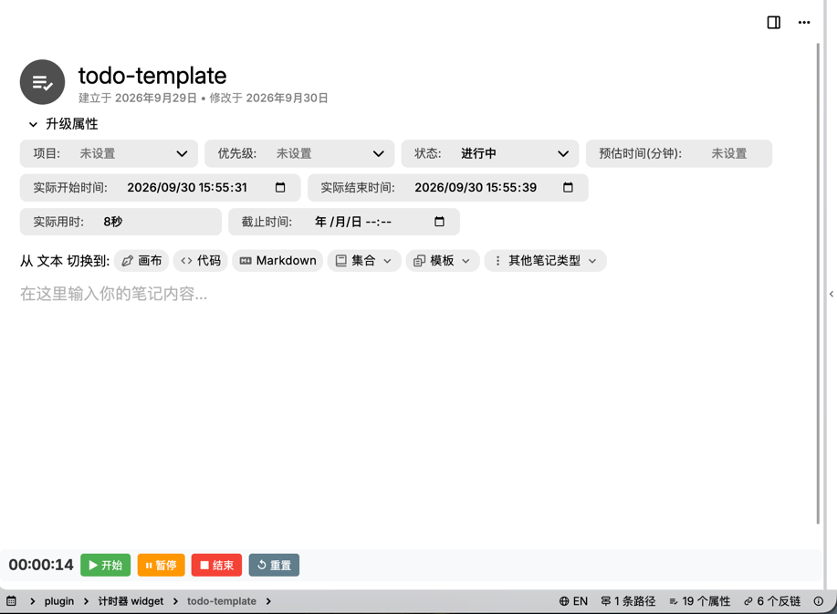

# 待办事项计时器

一个为 [Trilium Notes](https://github.com/zadam/trilium) 设计的轻量级任务计时小组件。它会在带有 `#naritodo` 标签的笔记中显示一个计时器面板，帮助你精准记录每个任务的专注时长。

## ✨ 功能特性

- **实时计时显示**：以 `时:分:秒` 格式实时展示当前任务耗时。
- **完整生命周期管理**：
    - **▶ 开始**：记录实际开始时间，状态自动切换为“进行中”。
    - **⏸ 暂停**：暂停计时，累计时间保留在内存中（不立即持久化）。
    - **■ 结束**：停止计时，计算总耗时，状态变为“已完成”，自动打上 `archived` 标签。
    - **↺ 重置**：仅清零当前计数器，不影响已保存的历史累计时间。
- **自动标签同步**：通过后端 API 自动写入开始时间、结束时间、累计秒数及格式化耗时。
- **智能加载**：通过 `isEnabled()` 控制，仅在有 `#naritodo` 标签的笔记详情页渲染，保持界面整洁。

## 📦 安装与部署

1. 在 Trilium 中创建一个新的 **JS Frontend API** 类型的笔记。
2. 将 Widget 的 JavaScript 代码粘贴到笔记内容中。
3. （可选）如果你希望将其作为模板使用，可以在笔记的标题或属性栏添加以下元数据：
   ```text
   #template #iconClass="bx bx-list-check" #naritodo
   ```
4. 确保该 JS 笔记被 Trilium 正确识别为 Widget（通常放在 `widgets` 分支下或通过 `#widget` 属性配置，具体取决于你的 Trilium 版本）。
5. 重启或刷新 Trilium 前端，Widget 即可生效。

## 🏷 标签与属性定义 (Attributes)

本 Widget 重度依赖笔记标签来存储状态和时间数据。建议将以下标签定义为**可继承 (inheritable)** 的模板属性，以便统一管理所有待办事项：

| 标签名称 | 别名 | 类型/选项 | 说明 |
| :--- | :--- | :--- | :--- |
| `#naritodo` | - | 标记 | **必填**，Widget 启用的开关 |
| `#project` | 项目 | 单选 | `work` / `daily` / `goal` |
| `#priority` | 优先级 | 单选 | `P0` / `P1` / `P2` / `P3` / `P4` |
| `#status` | 状态 | 单选 | `待办` / `进行中` / `已完成` / `取消` / `择期` |
| `#estimateMin` | 预估时间(分钟) | 数字 | 预估完成任务所需分钟数 |
| `#actualStartTime` | 实际开始时间 | 日期时间 | 点击“开始”时自动写入 |
| `#actualEndTime` | 实际结束时间 | 日期时间 | 点击“结束”时自动写入 |
| `#spentTime` | 实际用时 | 文本 | 格式化显示（如 `1.5小时`），自动生成 |
| `#spentTimes` | 实际用时 ms | 文本/数字 | 累计总秒数，用于精确计算 |
| `#actualTime` | 实际消耗时间(秒) | 数字 | 实际消耗时间（秒） |
| `#deadlineTime` | 截止时间 | 日期时间 | 任务截止时间 |

> **💡 快速导入**：你可以直接复制以下行到 Trilium 模板笔记的属性栏中一键创建这些标签定义：
> ```text
> #template #iconClass="bx bx-list-check" #naritodo #label:project(inheritable)="promoted,alias=项目,single,select,options=work;daily;goal" #label:priority(inheritable)="promoted,alias=优先级,single,select,options=P0;P1;P2;P3;P4" #label:status(inheritable)="promoted,alias=状态,single,select,options=待办;进行中;已完成;取消;择期" #label:estimateMin(inheritable)="promoted,alias=预估时间(分钟),single,number" #label:actualStartTime(inheritable)="promoted,alias=实际开始时间,single,datetime" #label:actualEndTime(inheritable)="promoted,alias=实际结束时间,single,datetime" #label:spentTime(inheritable)="promoted,alias=实际用时,single,text" #label:spentTimes(inheritable)="alias=实际用时 ms,single,text" #label:actualTime(inheritable)="alias=实际消耗时间(秒),single,number" #label:deadlineTime(inheritable)="promoted,alias=截止时间,single,datetime"
> ```

## 🎮 使用说明

1. 打开任意一个带有 `#naritodo` 标签的笔记。
2. 在笔记内容顶部会出现计时器控制面板。
3. **开始工作** → 点击 `▶ 开始`。
4. **临时离开** → 点击 `⏸ 暂停`，回来后可再次点击开始继续累计。
5. **任务完成** → 点击 `■ 结束`，系统会自动归档笔记并记录总耗时。
6. **操作失误** → 点击 `↺ 重置` 清除本次计时（不会删除历史记录）。

## 📄 License

MIT